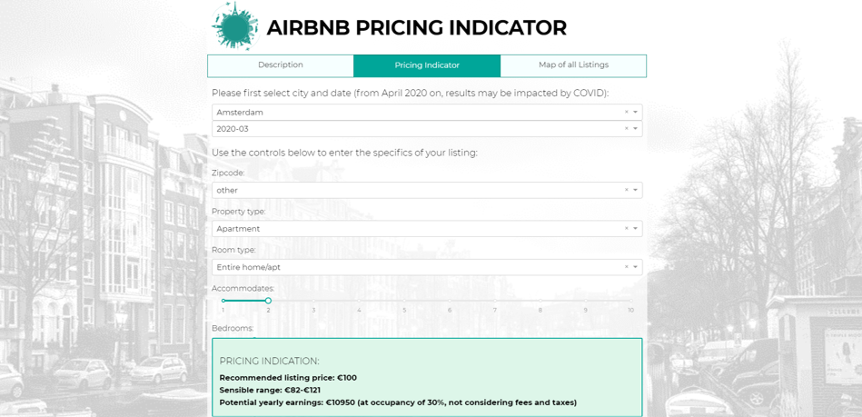

**Access the web application by clicking on the image (ctrl+click for new tab):**  

# Description
Predictive modeling applying the entire data science lifecycle and building a Plotly Dash web application for user interaction with the model (retrieve listing pricing indication).

**Core idea**: Taking data from a given specific listing time stamp of Berlin and other major European cities, can we accurately predict its price in order to provide future hosts with a solid pricing estimate without requiring an Airbnb account beforehand? (aim: offer a tool for new users to get a first pricing and potential earnings indication without requiring an account)

# Findings:
- While it is not a trivial task to predict based only on features potentially available before listing creation, the **predictive model yielded solid results** and can definitely serve as a first indicator when considering a new listing
- Of the eventually used features, **room type** appeared to be the most important one, followed by **guests included**, **bedrooms** and **host listings** (i.e. whether the host already has prior listings)

# Outcomes:
- **Predictive model** based on features that a user without a prior listing may be able to provide (e.g. guests, bedrooms, bathrooms, etc.)
- **Pricing indication** and range based on Median Average Percentage Error
- **Web application** providing the pricing indication and potential earnings estimate based on up to 24 listing features 
- **Interactive input fields** with sensible default values based on average listings
- **Dynamically changing listing recommendation** as soon as input values are adapted

# Files in repository:
- 1_Predictive_modeling.ipynb (Jupyter Notebook for Predictive Modeling, including data cleaning and feature engineering)
- 2_EDA.ipynb (Jupyter Notebook for EDA, including one part after data cleaning and another after data engineering)
- 3_App_preparation.ipynb (Jupyter Notebook for fast access to saved models as means to review and/or overwrite them)
- 4_App.py (Python code for web application)
- 5_Final_presentation.pdf (presentation of findings)

# Structure of 1_Predictive_Modeling.ipynb file
- **1 Business understanding and set-up**
  - 1.1 Background and key question
  - 1.2 Feature glossary
  - 1.3 Dataset glossary
  - 1.4 Target and metric
  - 1.5 Libraries and dashboard
  - 1.6 Global functions and variables
- **2 Data mining**
  - 2.1 Data review
  - 2.2 Data import
- **3 Data cleaning**
  - 3.1 Pre-cleaning
  - 3.2 Inspection
  - 3.3 Define data cleaning functions
  - 3.4 Apply data cleaning functions
  - 3.5 Final check and export
- **4 Feature engineering**
  - 4.1 Define feature engineering functions
  - 4.2 Apply feature engineering functions
  - 4.3 Final check and export
- **5 Preprocessing (train/test split and pipeline)**
  - 5.1 Preprocessing pipeline
  - 5.2 Train/test split
  - 5.3 Save preprocessor and X_test
  - 5.4 Feature selection (optional, on classification)
- **6 Modeling: Regression ("price_log")**
  - 6.1 Apply regression models
  - 6.2 Reg model 1: XGBoost
  - 6.3 Reg model 2: Support Vector Machines
  - 6.4 Reg model 3: Random Forest
  - 6.5 Reg model 4: CatBoost
  - 6.6 NN model 1: Neural Networks
- **7 Findings and implications**
- **8 Model selection for web application**
- **9 Future work**

# Python modules used
- Pandas
- NumPy
- Matplotlib
- SciPy
- Seaborn
- Math
- Datetime
- statsmodels
- Scikit Learn
- Keras
- Plotly
- Plotly Dash

# Future work
**Predictive modeling**
- Apply further models and adapt current ones (e.g. NN)
- Examine other prediction targets (e.g. occupancy rate)

**Feature engineering**
- Explore NLP for text fields (descriptions, reviews, ...)
- Scrape listing photos and analyze quality
- Enhance current feature set

**Lean structure**
- Remove remaining redundancies wherever possible (e.g. pack repeated steps into functions, apply more pipelines, ...)

**Cloud**
- Move both model creation and app into the cloud (GCP)

**Automatization and replicability**
- Build a workflow to automatically retrain model monthly with new datasets
- Use automated outlier detection
- Use automated feature engineering
- Let user input exact address and determine location

**Replicability**
- Apply analysis to other cities and compare results

**Specific open tasks/topics**
- Explore how to use calendar data for availability
- Categorize listings by quality (low/mid/high)
- Calculate average price based on weighted prices from past months/years
- Determine own review score through text recognition
- Automatize creation of log and sqrt columns (e.g. based on skew)
- Convert price to EUR and consequently remove the conversion in app
- Create new feature out of binned longitude and latitude (more granular than zipcode)
